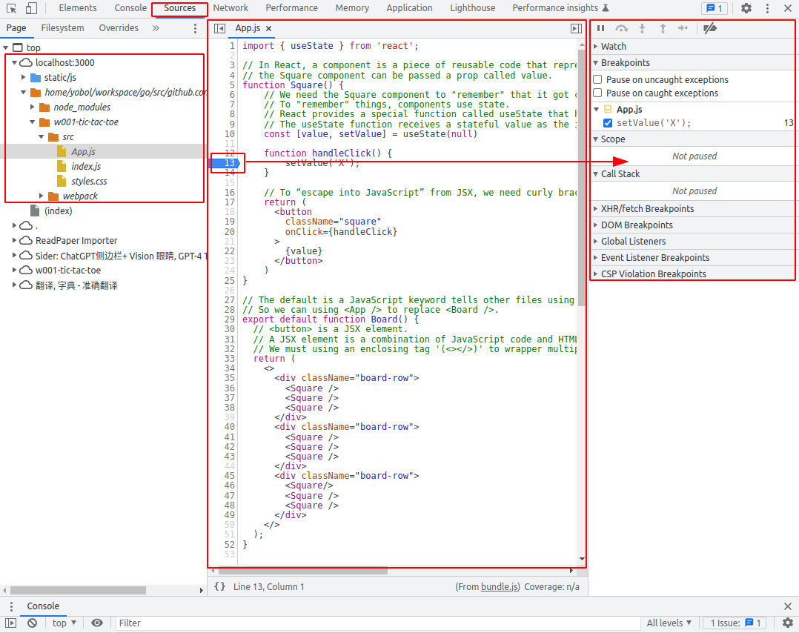
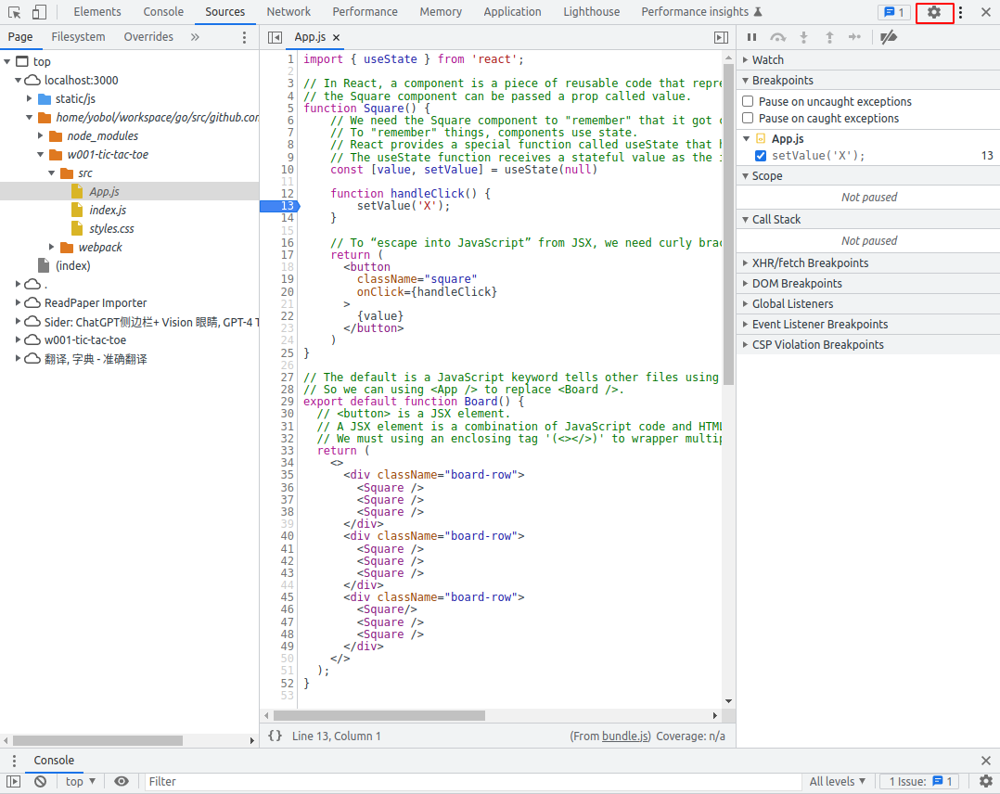
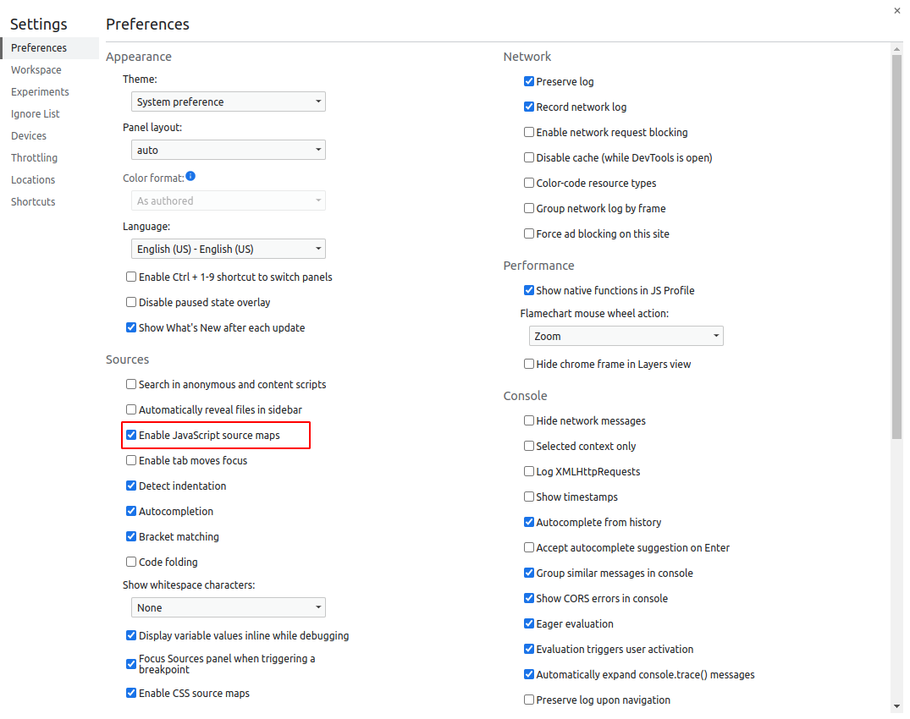

# Tic-Tac-Toe

Following the tutorial: [Tutorial: Tic-Tac-Toe](https://react.dev/learn/tutorial-tic-tac-toe).

# Install dependencies

```shell
npm add react
npm add react-dom
npm add react-scripts

npm install
```

# Run package scripts

Running the package script:

```shell
npm start
```

# Debug in a local browser (such as Chrome)

Press `Ctrl+Shift+I` to open the developer tools. Switch to the `Sources` tab.



Note: `Enalbe JavaScript source maps`.




